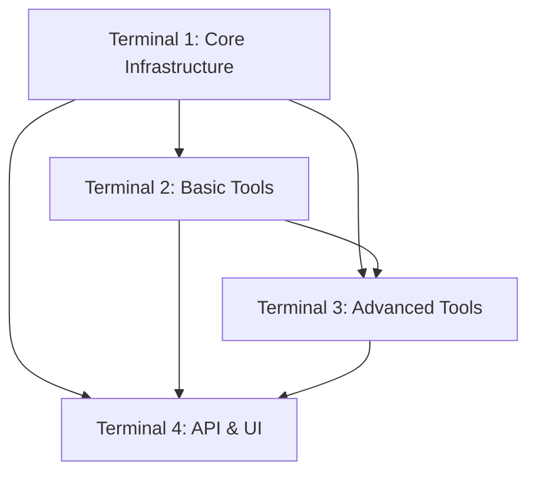

# AI Tools Implementation - Parallel Development Plan (4 Terminals)

## 🎯 Strategie rozdělení práce

Rozdělení do 4 terminálů s ohledem na závislosti a logické celky.

---

## 📊 Dependency Matrix



---

## 🖥️ Terminal 1: Core Infrastructure & Foundation
**Branch:** `feature/ai-tools-infrastructure`
**Priorita:** KRITICKÁ - Ostatní na tomto závisí!

### Phase 1: Core Interfaces (MUSÍ BÝT PRVNÍ!)
- [ ] Create `OAI.Core/Interfaces/Tools/ITool.cs`
- [ ] Create `OAI.Core/Interfaces/Tools/IToolRegistry.cs`
- [ ] Create `OAI.Core/Interfaces/Tools/IToolExecutor.cs`
- [ ] Create `OAI.Core/Interfaces/Tools/IToolResult.cs`
- [ ] Create `OAI.Core/Interfaces/Tools/IToolParameter.cs`
- [ ] Create `OAI.Core/Interfaces/Tools/IToolSecurity.cs`

### Phase 2: Core Entities & DTOs
- [ ] Create `OAI.Core/Entities/ToolDefinition.cs`
- [ ] Create `OAI.Core/Entities/ToolExecution.cs`
- [ ] Create `OAI.Core/DTOs/Tools/ToolDefinitionDto.cs`
- [ ] Create `OAI.Core/DTOs/Tools/ToolExecutionDto.cs`
- [ ] Create `OAI.Core/DTOs/Tools/ToolResultDto.cs`
- [ ] Create `OAI.Core/DTOs/Tools/CreateToolExecutionDto.cs`

### Phase 3: Base Implementations
- [ ] Create `OAI.ServiceLayer/Services/Tools/Base/BaseTool.cs`
- [ ] Create `OAI.ServiceLayer/Services/Tools/Base/ToolResult.cs`
- [ ] Create `OAI.ServiceLayer/Services/Tools/ToolRegistryService.cs`
- [ ] Create `OAI.ServiceLayer/Services/Tools/ToolExecutorService.cs`
- [ ] Create `OAI.ServiceLayer/Mapping/ToolDefinitionMapper.cs`
- [ ] Create `OAI.ServiceLayer/Mapping/ToolExecutionMapper.cs`

### Phase 4: Security & Validation
- [ ] Create `OAI.ServiceLayer/Services/Tools/ToolSecurityService.cs`
- [ ] Create `Validation/ToolExecutionValidator.cs`
- [ ] Create `Validation/ToolParameterValidator.cs`
- [ ] Add rate limiting configuration for tools
- [ ] Create sandbox execution context

### Phase 5: Enhanced Ollama Integration
- [ ] Extend `OllamaService` with tool calling support
- [ ] Add tool response parsing in `OllamaModels.cs`
- [ ] Create `ToolCallingChatRequest` model
- [ ] Implement tool result formatting
- [ ] Add tool-aware conversation handling

**Estimated Time:** 4-6 hours
**Dependencies:** None - this is the foundation

---

## 🖥️ Terminal 2: Basic Tools Implementation
**Branch:** `feature/ai-tools-basic`
**Priorita:** HIGH - Základní nástroje pro testování

### Wait for Terminal 1 to complete:
- [ ] Phase 1 & 2 from Terminal 1 must be done
- [ ] Pull Terminal 1 changes before starting

### Phase 1: File Operations Tool
- [ ] Create `OAI.ServiceLayer/Services/Tools/FileOperationsTool.cs`
- [ ] Implement read file method
- [ ] Implement write file method
- [ ] Implement list directory method
- [ ] Add path validation and security checks
- [ ] Create unit tests

### Phase 2: Text Processing Tool
- [ ] Create `OAI.ServiceLayer/Services/Tools/TextProcessingTool.cs`
- [ ] Implement text summarization
- [ ] Implement format conversion (MD, HTML, TXT)
- [ ] Add text extraction from documents
- [ ] Implement text cleaning and normalization
- [ ] Create unit tests

### Phase 3: Web Search Tool
- [ ] Create `OAI.ServiceLayer/Services/Tools/WebSearchTool.cs`
- [ ] Create search provider interface
- [ ] Implement DuckDuckGo search (no API key needed)
- [ ] Add web scraping with HtmlAgilityPack
- [ ] Implement content summarization
- [ ] Add caching mechanism
- [ ] Create unit tests

### Phase 4: Data Processing Tool
- [ ] Create `OAI.ServiceLayer/Services/Tools/DataProcessingTool.cs`
- [ ] Implement JSON parsing and manipulation
- [ ] Add CSV processing
- [ ] Create data transformation methods
- [ ] Add data validation
- [ ] Create unit tests

**Estimated Time:** 6-8 hours
**Dependencies:** Terminal 1 (Phase 1 & 2)

---

## 🖥️ Terminal 3: Advanced Tools & Code Generation
**Branch:** `feature/ai-tools-advanced`
**Priorita:** MEDIUM - Pokročilé funkce

### Wait for Terminal 1 to complete:
- [ ] Phase 1, 2 & 3 from Terminal 1 must be done
- [ ] Pull Terminal 1 changes before starting

### Phase 1: Code Generation Tool
- [ ] Create `OAI.ServiceLayer/Services/Tools/CodeGenerationTool.cs`
- [ ] Add multi-language support (C#, Python, JS, SQL)
- [ ] Implement syntax validation
- [ ] Add code formatting
- [ ] Create code templates system
- [ ] Implement error checking

### Phase 2: Code Execution Sandbox
- [ ] Create `OAI.ServiceLayer/Services/Tools/CodeExecutionService.cs`
- [ ] Create Docker configuration for sandbox
- [ ] Implement C# code execution via Roslyn
- [ ] Add Python execution support
- [ ] Implement timeout and resource limits
- [ ] Add output capture and streaming

### Phase 3: Database Query Tool
- [ ] Create `OAI.ServiceLayer/Services/Tools/DatabaseQueryTool.cs`
- [ ] Implement natural language to SQL
- [ ] Add query validation
- [ ] Create safe query execution
- [ ] Add result formatting
- [ ] Implement query optimization suggestions

### Phase 4: API Integration Tool
- [ ] Create `OAI.ServiceLayer/Services/Tools/ApiIntegrationTool.cs`
- [ ] Implement REST client
- [ ] Add request builder from natural language
- [ ] Create response parser
- [ ] Add authentication support
- [ ] Implement retry logic

**Estimated Time:** 8-10 hours
**Dependencies:** Terminal 1 (All phases)

---

## 🖥️ Terminal 4: API, UI & Integration
**Branch:** `feature/ai-tools-api-ui`
**Priorita:** MEDIUM - User-facing komponenty

### Wait for Terminal 1 & 2 to make progress:
- [ ] Terminal 1 Phase 1-3 must be done
- [ ] Terminal 2 Phase 1 should be started
- [ ] Pull changes from both branches

### Phase 1: API Controllers
- [ ] Create `Controllers/ToolsController.cs`
- [ ] Implement GET /api/tools (list all tools)
- [ ] Implement POST /api/tools/execute
- [ ] Implement GET /api/tools/{toolId}/executions
- [ ] Add tool search endpoint
- [ ] Create Swagger documentation

### Phase 2: Tool Management API
- [ ] Create `Controllers/ToolManagementController.cs`
- [ ] Add enable/disable tool endpoints
- [ ] Create tool configuration endpoints
- [ ] Implement tool testing endpoint
- [ ] Add performance metrics endpoints

### Phase 3: UI Views
- [ ] Create `Views/Tools/Index.cshtml` (tool listing)
- [ ] Create `Views/Tools/Execute.cshtml` (tool execution UI)
- [ ] Create `Views/Tools/History.cshtml` (execution history)
- [ ] Update Chat UI to show tool usage
- [ ] Add tool selection in chat interface

### Phase 4: Real-time Integration
- [ ] Create `Hubs/ToolHub.cs` for SignalR
- [ ] Implement tool execution progress updates
- [ ] Add real-time result streaming
- [ ] Create execution status notifications
- [ ] Update existing ChatHub for tool integration

### Phase 5: Integration & Testing
- [ ] Create integration tests for API endpoints
- [ ] Test tool execution flow end-to-end
- [ ] Add performance monitoring
- [ ] Create usage analytics
- [ ] Document API usage

**Estimated Time:** 6-8 hours
**Dependencies:** Terminal 1 & 2 (partially)

---

## 🚀 Startup Instructions

### All Terminals - Initial Setup:
```bash
cd /Users/lewi/Documents/Vyvoj/OptimalyAI
git fetch origin
git pull origin main
```

### Terminal 1 (Start IMMEDIATELY):
```bash
git checkout -b feature/ai-tools-infrastructure
code .

# Instrukce pro Claude:
"Pracuji na Terminal 1 z AI_TOOLS_PARALLEL_IMPLEMENTATION.md
Implementuj všechny položky v pořadí jak jsou uvedeny.
Toto je kritická infrastruktura na které závisí ostatní terminály.
Začni s Phase 1: Core Interfaces."
```

### Terminal 2 (Start after T1 Phase 2):
```bash
# Počkej až Terminal 1 dokončí Phase 1 & 2
git checkout -b feature/ai-tools-basic
git pull origin feature/ai-tools-infrastructure
code .

# Instrukce pro Claude:
"Pracuji na Terminal 2 z AI_TOOLS_PARALLEL_IMPLEMENTATION.md
Terminal 1 už vytvořil základní interfaces a entity.
Implementuj základní tools začínaje FileOperationsTool."
```

### Terminal 3 (Start after T1 Phase 3):
```bash
# Počkej až Terminal 1 dokončí Phase 1, 2 & 3
git checkout -b feature/ai-tools-advanced
git pull origin feature/ai-tools-infrastructure
code .

# Instrukce pro Claude:
"Pracuji na Terminal 3 z AI_TOOLS_PARALLEL_IMPLEMENTATION.md
Implementuj pokročilé tools, především CodeGenerationTool.
Využij infrastrukturu z Terminal 1."
```

### Terminal 4 (Start after T1 Phase 3):
```bash
# Počkej až Terminal 1 dokončí Phase 1-3
git checkout -b feature/ai-tools-api-ui
git pull origin feature/ai-tools-infrastructure
code .

# Instrukce pro Claude:
"Pracuji na Terminal 4 z AI_TOOLS_PARALLEL_IMPLEMENTATION.md
Vytvoř API controllers a UI pro tools.
Koordinuj se s Terminal 2 pro testování."
```

---

## 🔄 Synchronization Points

### Critical Sync Points:
1. **T1 Phase 1 complete** → T2, T3, T4 can start
2. **T1 Phase 3 complete** → T3, T4 pull changes
3. **T2 Phase 1 complete** → T4 can test with real tool
4. **All terminals** → Daily morning sync

### Sync Commands:
```bash
# Stash local changes
git stash

# Fetch and merge from other branches
git fetch origin
git merge origin/feature/ai-tools-infrastructure --no-ff

# Apply stashed changes
git stash pop

# Resolve conflicts if any
```

---

## 📋 NuGet Dependencies

### Terminal 1:
```xml
<!-- Already in project -->
```

### Terminal 2:
```xml
<PackageReference Include="HtmlAgilityPack" Version="1.11.54" />
<PackageReference Include="CsvHelper" Version="30.0.1" />
```

### Terminal 3:
```xml
<PackageReference Include="Microsoft.CodeAnalysis.CSharp" Version="4.8.0" />
<PackageReference Include="Docker.DotNet" Version="3.125.15" />
```

### Terminal 4:
```xml
<!-- Use existing packages -->
```

---

## ⚠️ Important Notes

1. **Terminal 1 je kritický** - ostatní nemohou začít bez něj
2. **Pravidelně commitujte** - každou hodinu minimálně
3. **Testujte incrementálně** - po každé implementované metodě
4. **Dokumentujte změny** - updateujte CLAUDE.md s novými patterns
5. **Neměňte existující kód** - pouze rozšiřujte

---

## 🎯 Definition of Done

### Pro každý tool:
- [ ] Implementace dokončena
- [ ] Unit testy napsány
- [ ] Dokumentace přidána
- [ ] Code review (self-review) proveden
- [ ] Žádné build warnings
- [ ] Funkční v integračním testu

### Pro každý terminal:
- [ ] Všechny fáze dokončeny
- [ ] Branch připraven na merge
- [ ] Conflicts vyřešeny
- [ ] PR vytvořen s popisem změn

---

Last Updated: {{ current_date }}