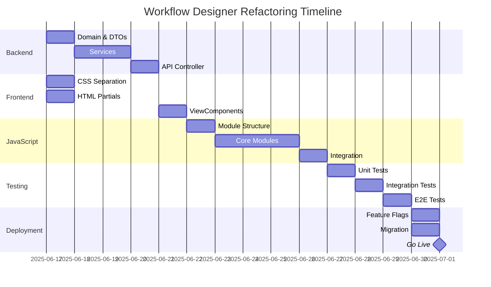

# Workflow Designer - Clean Architecture Refactoring Plan

## 📋 Executive Summary

Komplexní plán refaktoringu Workflow Designeru s důrazem na Clean Architecture, modularitu a testovatelnost.

**Klíčové principy:**
- 🏗️ Striktní dodržování Clean Architecture
- 🔄 Oddělení business logiky od UI
- 🧪 Testovatelnost na všech úrovních
- 📦 Modulární JavaScript architektura
- 🚀 Postupná migrace bez narušení funkcionality

## 🏛️ Architektura po refaktoringu

```
OptimalyAI/ (Presentation Layer)
├── Controllers/
│   ├── WorkflowDesignerController.cs      # MVC controller pro views
│   └── Api/
│       └── WorkflowApiController.cs       # REST API endpoints
├── ViewModels/
│   ├── WorkflowDesignerViewModel.cs       # Main view model
│   ├── WorkflowNodeViewModel.cs           # Node representation
│   └── WorkflowToolboxViewModel.cs        # Toolbox data
├── ViewComponents/
│   ├── WorkflowCanvasViewComponent.cs     # Canvas rendering
│   ├── WorkflowToolboxViewComponent.cs    # Tool palette
│   └── WorkflowPropertiesViewComponent.cs # Property editor
├── Views/WorkflowDesigner/
│   ├── Index.cshtml                       # Main view (< 200 lines)
│   └── _Partials/
│       ├── _Canvas.cshtml
│       ├── _Toolbox.cshtml
│       └── _Properties.cshtml
└── wwwroot/
    ├── css/workflow/
    │   ├── workflow-designer.css
    │   ├── workflow-nodes.css
    │   └── workflow-canvas.css
    └── js/workflow/
        ├── workflow-designer.js           # Main orchestrator
        └── modules/
            ├── canvas-manager.js
            ├── node-manager.js
            ├── connection-manager.js
            ├── property-editor.js
            └── workflow-api-client.js

OAI.ServiceLayer/ (Business Logic)
├── Services/Workflow/
│   ├── WorkflowDesignerService.cs         # Main business logic
│   ├── WorkflowValidationService.cs       # Validation rules
│   ├── WorkflowExecutionService.cs        # Execution engine
│   └── WorkflowPersistenceService.cs      # Save/Load operations
├── Orchestration/Workflow/
│   └── WorkflowOrchestrator.cs            # Complex workflow operations
└── Mapping/
    └── WorkflowMapper.cs                  # Entity <-> DTO mapping

OAI.Core/ (Domain & Contracts)
├── Entities/Workflow/
│   ├── WorkflowDefinition.cs              # Main workflow entity
│   ├── WorkflowNode.cs                    # Node entity
│   └── WorkflowConnection.cs              # Connection entity
├── DTOs/Workflow/
│   ├── WorkflowDto.cs
│   ├── WorkflowNodeDto.cs
│   ├── WorkflowConnectionDto.cs
│   └── WorkflowExecutionResultDto.cs
├── Interfaces/Workflow/
│   ├── IWorkflowDesignerService.cs
│   ├── IWorkflowValidator.cs
│   └── IWorkflowExecutor.cs
└── Enums/
    ├── WorkflowNodeType.cs
    └── WorkflowStatus.cs

OAI.DataLayer/
└── Repositories/
    └── WorkflowRepository.cs              # Data access
```

---

## ✅ Fáze 1: Příprava a analýza (1 den)

### 1.1 Analýza současného stavu
- [ ] Zmapovat všechny funkcionality v `SimpleWorkflowDesigner.cshtml`
- [ ] Identifikovat business logiku vs. UI logiku
- [ ] Vytvořit seznam všech API volání
- [ ] Zdokumentovat data flow

### 1.2 Vytvoření testů pro současnou funkcionalitu
- [ ] E2E testy kritických user journeys
- [ ] Snapshot testy pro UI komponenty
- [ ] API testy pro backend endpoints

### 1.3 Setup vývojového prostředí
- [ ] Nastavit hot reload pro JS moduly
- [ ] Připravit build pipeline pro CSS/JS
- [ ] Vytvořit feature flag pro postupné zapínání

---

## ✅ Fáze 2: Backend refaktoring (3-4 dny)

### 2.1 Domain Layer (OAI.Core)

#### Entities
```csharp
// OAI.Core/Entities/Workflow/WorkflowDefinition.cs
namespace OAI.Core.Entities.Workflow
{
    public class WorkflowDefinition : BaseEntity
    {
        public Guid ProjectId { get; set; }
        public string Name { get; set; }
        public string Description { get; set; }
        public WorkflowStatus Status { get; set; }
        public string Version { get; set; }
        
        // JSON serialized workflow structure
        public string DefinitionJson { get; set; }
        
        // Navigation
        public virtual Project Project { get; set; }
        public virtual ICollection<WorkflowNode> Nodes { get; set; }
        public virtual ICollection<WorkflowConnection> Connections { get; set; }
        public virtual ICollection<WorkflowExecution> Executions { get; set; }
    }
}

// OAI.Core/Entities/Workflow/WorkflowNode.cs
namespace OAI.Core.Entities.Workflow
{
    public class WorkflowNode : BaseEntity
    {
        public Guid WorkflowDefinitionId { get; set; }
        public string NodeId { get; set; } // Unique within workflow
        public WorkflowNodeType Type { get; set; }
        public string Name { get; set; }
        public double PositionX { get; set; }
        public double PositionY { get; set; }
        
        // Tool or adapter configuration
        public string ConfigurationJson { get; set; }
        
        // Navigation
        public virtual WorkflowDefinition WorkflowDefinition { get; set; }
        public virtual ICollection<WorkflowConnection> OutgoingConnections { get; set; }
        public virtual ICollection<WorkflowConnection> IncomingConnections { get; set; }
    }
}
```

#### DTOs
```csharp
// OAI.Core/DTOs/Workflow/WorkflowNodeDto.cs
namespace OAI.Core.DTOs.Workflow
{
    public class WorkflowNodeDto
    {
        public string Id { get; set; }
        public string Type { get; set; }
        public string Name { get; set; }
        public NodePositionDto Position { get; set; }
        public Dictionary<string, object> Properties { get; set; }
        public List<NodePortDto> InputPorts { get; set; }
        public List<NodePortDto> OutputPorts { get; set; }
    }
    
    public class NodePositionDto
    {
        public double X { get; set; }
        public double Y { get; set; }
    }
    
    public class NodePortDto
    {
        public string Id { get; set; }
        public string Name { get; set; }
        public string DataType { get; set; }
        public bool IsRequired { get; set; }
    }
}
```

#### Interfaces
```csharp
// OAI.Core/Interfaces/Workflow/IWorkflowDesignerService.cs
namespace OAI.Core.Interfaces.Workflow
{
    public interface IWorkflowDesignerService
    {
        Task<WorkflowDto> GetWorkflowAsync(Guid projectId);
        Task<WorkflowDto> SaveWorkflowAsync(Guid projectId, WorkflowDto workflow);
        Task<ValidationResult> ValidateWorkflowAsync(WorkflowDto workflow);
        Task<List<ToolDefinitionDto>> GetAvailableToolsAsync();
        Task<List<AdapterDefinitionDto>> GetAvailableAdaptersAsync();
    }
}
```

### 2.2 Service Layer (OAI.ServiceLayer)

#### Main Service
```csharp
// OAI.ServiceLayer/Services/Workflow/WorkflowDesignerService.cs
namespace OAI.ServiceLayer.Services.Workflow
{
    public class WorkflowDesignerService : IWorkflowDesignerService
    {
        private readonly IRepository<WorkflowDefinition> _workflowRepo;
        private readonly IWorkflowValidator _validator;
        private readonly IToolRegistry _toolRegistry;
        private readonly IAdapterRegistry _adapterRegistry;
        private readonly IMapper<WorkflowDefinition, WorkflowDto> _mapper;
        private readonly ILogger<WorkflowDesignerService> _logger;
        
        public async Task<WorkflowDto> GetWorkflowAsync(Guid projectId)
        {
            var workflow = await _workflowRepo
                .GetQueryable()
                .Include(w => w.Nodes)
                .Include(w => w.Connections)
                .FirstOrDefaultAsync(w => w.ProjectId == projectId);
                
            if (workflow == null)
            {
                // Create new workflow for project
                workflow = await CreateDefaultWorkflow(projectId);
            }
            
            return _mapper.MapToDto(workflow);
        }
        
        public async Task<WorkflowDto> SaveWorkflowAsync(Guid projectId, WorkflowDto workflowDto)
        {
            // Validate
            var validationResult = await _validator.ValidateAsync(workflowDto);
            if (!validationResult.IsValid)
            {
                throw new ValidationException(validationResult.Errors);
            }
            
            // Map and save
            var workflow = await _workflowRepo
                .GetQueryable()
                .Include(w => w.Nodes)
                .Include(w => w.Connections)
                .FirstOrDefaultAsync(w => w.ProjectId == projectId);
                
            if (workflow == null)
            {
                workflow = new WorkflowDefinition { ProjectId = projectId };
                await _workflowRepo.AddAsync(workflow);
            }
            
            // Update workflow from DTO
            _mapper.UpdateEntity(workflow, workflowDto);
            
            // Save changes
            await _workflowRepo.SaveChangesAsync();
            
            _logger.LogInformation("Workflow saved for project {ProjectId}", projectId);
            
            return _mapper.MapToDto(workflow);
        }
    }
}
```

#### Validation Service
```csharp
// OAI.ServiceLayer/Services/Workflow/WorkflowValidationService.cs
namespace OAI.ServiceLayer.Services.Workflow
{
    public class WorkflowValidationService : IWorkflowValidator
    {
        public async Task<ValidationResult> ValidateAsync(WorkflowDto workflow)
        {
            var result = new ValidationResult();
            
            // Check for start node
            var startNodes = workflow.Nodes.Where(n => n.Type == "Start").ToList();
            if (startNodes.Count == 0)
            {
                result.AddError("Workflow must have at least one Start node");
            }
            else if (startNodes.Count > 1)
            {
                result.AddError("Workflow can have only one Start node");
            }
            
            // Check for orphaned nodes
            var connectedNodeIds = workflow.Connections
                .SelectMany(c => new[] { c.SourceNodeId, c.TargetNodeId })
                .Distinct()
                .ToHashSet();
                
            var orphanedNodes = workflow.Nodes
                .Where(n => n.Type != "Start" && !connectedNodeIds.Contains(n.Id))
                .ToList();
                
            if (orphanedNodes.Any())
            {
                result.AddWarning($"Found {orphanedNodes.Count} disconnected nodes");
            }
            
            // Check for cycles
            if (await HasCyclesAsync(workflow))
            {
                result.AddError("Workflow contains cycles");
            }
            
            // Validate individual nodes
            foreach (var node in workflow.Nodes)
            {
                await ValidateNode(node, result);
            }
            
            return result;
        }
        
        private async Task ValidateNode(WorkflowNodeDto node, ValidationResult result)
        {
            // Node-specific validation based on type
            switch (node.Type)
            {
                case "Tool":
                    if (!node.Properties.ContainsKey("toolId"))
                    {
                        result.AddError($"Node {node.Name} is missing tool configuration");
                    }
                    break;
                    
                case "Condition":
                    if (!node.Properties.ContainsKey("expression"))
                    {
                        result.AddError($"Condition node {node.Name} is missing expression");
                    }
                    break;
            }
        }
    }
}
```

### 2.3 Presentation Layer (OptimalyAI)

#### API Controller
```csharp
// OptimalyAI/Controllers/Api/WorkflowApiController.cs
namespace OptimalyAI.Controllers.Api
{
    [Route("api/workflow")]
    [ApiController]
    [Authorize]
    public class WorkflowApiController : BaseApiController
    {
        private readonly IWorkflowDesignerService _workflowService;
        private readonly IWorkflowExecutor _workflowExecutor;
        
        [HttpGet("{projectId}")]
        public async Task<ActionResult<ApiResponse<WorkflowDto>>> GetWorkflow(Guid projectId)
        {
            var workflow = await _workflowService.GetWorkflowAsync(projectId);
            return Success(workflow);
        }
        
        [HttpPost("{projectId}")]
        public async Task<ActionResult<ApiResponse<WorkflowDto>>> SaveWorkflow(
            Guid projectId, 
            [FromBody] WorkflowDto workflow)
        {
            workflow.ProjectId = projectId;
            var saved = await _workflowService.SaveWorkflowAsync(projectId, workflow);
            return Success(saved, "Workflow saved successfully");
        }
        
        [HttpPost("{projectId}/validate")]
        public async Task<ActionResult<ApiResponse<ValidationResult>>> ValidateWorkflow(
            Guid projectId,
            [FromBody] WorkflowDto workflow)
        {
            var result = await _workflowService.ValidateWorkflowAsync(workflow);
            return Success(result);
        }
        
        [HttpPost("{projectId}/nodes")]
        public async Task<ActionResult<ApiResponse<WorkflowNodeDto>>> AddNode(
            Guid projectId,
            [FromBody] CreateNodeDto createNode)
        {
            // Add node logic
            return Success(newNode);
        }
        
        [HttpPut("{projectId}/nodes/{nodeId}")]
        public async Task<ActionResult<ApiResponse<WorkflowNodeDto>>> UpdateNode(
            Guid projectId,
            string nodeId,
            [FromBody] UpdateNodeDto updateNode)
        {
            // Update node logic
            return Success(updatedNode);
        }
        
        [HttpDelete("{projectId}/nodes/{nodeId}")]
        public async Task<ActionResult<ApiResponse>> DeleteNode(
            Guid projectId,
            string nodeId)
        {
            // Delete node logic
            return Success("Node deleted");
        }
        
        [HttpPost("{projectId}/execute")]
        public async Task<ActionResult<ApiResponse<WorkflowExecutionResultDto>>> ExecuteWorkflow(
            Guid projectId,
            [FromBody] ExecuteWorkflowDto executeRequest)
        {
            var result = await _workflowExecutor.ExecuteAsync(projectId, executeRequest);
            return Success(result);
        }
    }
}
```

#### ViewModels
```csharp
// OptimalyAI/ViewModels/WorkflowDesignerViewModel.cs
namespace OptimalyAI.ViewModels
{
    public class WorkflowDesignerViewModel
    {
        public Guid ProjectId { get; set; }
        public string ProjectName { get; set; }
        public bool IsReadOnly { get; set; }
        public WorkflowDto Workflow { get; set; }
        
        // UI Configuration
        public WorkflowDesignerConfig Config { get; set; }
        
        // Available tools and adapters for toolbox
        public List<ToolDefinitionDto> AvailableTools { get; set; }
        public List<AdapterDefinitionDto> AvailableAdapters { get; set; }
    }
    
    public class WorkflowDesignerConfig
    {
        public bool EnableAutoSave { get; set; } = true;
        public int AutoSaveIntervalSeconds { get; set; } = 30;
        public bool EnableValidation { get; set; } = true;
        public bool ShowMinimap { get; set; } = true;
        public bool EnableDebugMode { get; set; } = false;
    }
}
```

---

## ✅ Fáze 3: Frontend separace (2-3 dny)

### 3.1 CSS Modularizace

#### Struktura CSS
```
/wwwroot/css/workflow/
├── workflow-designer.css          # Main container, layout
├── workflow-canvas.css            # Canvas, grid, zoom
├── workflow-nodes.css             # Node styles by type
├── workflow-connections.css       # SVG path styles
├── workflow-toolbox.css          # Toolbox panel
├── workflow-properties.css       # Properties panel
├── workflow-minimap.css          # Minimap component
└── workflow-themes.css           # Dark/light theme support
```

#### Příklad workflow-nodes.css
```css
/* Base node styles */
.workflow-node {
    position: absolute;
    background: var(--node-bg);
    border: 2px solid var(--node-border);
    border-radius: 8px;
    min-width: 180px;
    box-shadow: 0 2px 4px rgba(0,0,0,0.1);
    transition: all 0.2s ease;
    cursor: move;
}

.workflow-node:hover {
    box-shadow: 0 4px 8px rgba(0,0,0,0.15);
    transform: translateY(-1px);
}

.workflow-node.selected {
    border-color: var(--primary-color);
    box-shadow: 0 0 0 3px rgba(var(--primary-rgb), 0.2);
}

/* Node type specific styles */
.workflow-node[data-type="start"] {
    --node-bg: #4caf50;
    --node-border: #388e3c;
    border-radius: 50px;
}

.workflow-node[data-type="tool"] {
    --node-bg: #2196f3;
    --node-border: #1976d2;
}

.workflow-node[data-type="condition"] {
    --node-bg: #ff9800;
    --node-border: #f57c00;
    transform: rotate(45deg);
}

.workflow-node[data-type="condition"] .node-content {
    transform: rotate(-45deg);
}

/* Node ports */
.node-port {
    position: absolute;
    width: 12px;
    height: 12px;
    background: #fff;
    border: 2px solid var(--node-border);
    border-radius: 50%;
    cursor: crosshair;
}

.node-port.input {
    left: -6px;
    top: 50%;
    transform: translateY(-50%);
}

.node-port.output {
    right: -6px;
    top: 50%;
    transform: translateY(-50%);
}

.node-port:hover {
    background: var(--primary-color);
    transform: translateY(-50%) scale(1.2);
}
```

### 3.2 HTML Partial Views

#### Main View (Simplified)
```html
<!-- Views/WorkflowDesigner/Index.cshtml -->
@model WorkflowDesignerViewModel
@{
    ViewData["Title"] = $"Workflow Designer - {Model.ProjectName}";
    Layout = "_Layout";
}

@section Styles {
    <link rel="stylesheet" href="~/css/workflow/workflow-designer.css" />
    <link rel="stylesheet" href="~/css/workflow/workflow-canvas.css" />
    <link rel="stylesheet" href="~/css/workflow/workflow-nodes.css" />
    <link rel="stylesheet" href="~/css/workflow/workflow-connections.css" />
    <link rel="stylesheet" href="~/css/workflow/workflow-toolbox.css" />
    <link rel="stylesheet" href="~/css/workflow/workflow-properties.css" />
}

<div class="workflow-designer" 
     data-project-id="@Model.ProjectId" 
     data-readonly="@Model.IsReadOnly.ToString().ToLower()">
    
    <div class="designer-header">
        @await Html.PartialAsync("_WorkflowHeader", Model)
    </div>
    
    <div class="designer-body">
        <div class="designer-sidebar-left">
            @await Component.InvokeAsync("WorkflowToolbox", new { 
                tools = Model.AvailableTools,
                adapters = Model.AvailableAdapters 
            })
        </div>
        
        <div class="designer-main">
            @await Component.InvokeAsync("WorkflowCanvas", new { 
                workflow = Model.Workflow,
                config = Model.Config 
            })
        </div>
        
        <div class="designer-sidebar-right">
            @await Component.InvokeAsync("WorkflowProperties")
        </div>
    </div>
</div>

@section Scripts {
    <script>
        window.WorkflowConfig = @Html.Raw(Json.Serialize(Model.Config));
        window.WorkflowData = @Html.Raw(Json.Serialize(Model.Workflow));
    </script>
    <script type="module" src="~/js/workflow/workflow-designer.js"></script>
}
```

---

## ✅ Fáze 4: JavaScript architektura (4-5 dní)

### 4.1 Modulární struktura

```
/wwwroot/js/workflow/
├── workflow-designer.js           # Main orchestrator
├── modules/
│   ├── canvas-manager.js         # Canvas rendering, zoom, pan
│   ├── node-manager.js           # Node CRUD operations
│   ├── connection-manager.js     # Connection handling
│   ├── selection-manager.js      # Multi-select, box select
│   ├── property-editor.js        # Property panel logic
│   ├── toolbox-manager.js        # Drag & drop from toolbox
│   ├── command-manager.js        # Undo/redo support
│   ├── validation-manager.js     # Real-time validation
│   ├── persistence-manager.js    # Auto-save, manual save
│   └── workflow-api-client.js    # API communication
├── utils/
│   ├── constants.js
│   ├── event-bus.js              # Internal messaging
│   ├── geometry.js               # Connection path calculations
│   └── dom-helpers.js
└── types/
    └── workflow-types.d.ts       # TypeScript definitions
```

### 4.2 Main Orchestrator

```javascript
// workflow-designer.js
import { CanvasManager } from './modules/canvas-manager.js';
import { NodeManager } from './modules/node-manager.js';
import { ConnectionManager } from './modules/connection-manager.js';
import { SelectionManager } from './modules/selection-manager.js';
import { PropertyEditor } from './modules/property-editor.js';
import { ToolboxManager } from './modules/toolbox-manager.js';
import { CommandManager } from './modules/command-manager.js';
import { ValidationManager } from './modules/validation-manager.js';
import { PersistenceManager } from './modules/persistence-manager.js';
import { WorkflowApiClient } from './modules/workflow-api-client.js';
import { EventBus } from './utils/event-bus.js';

export class WorkflowDesigner {
    constructor(container, config = {}) {
        this.container = container;
        this.config = { ...this.defaultConfig, ...config };
        this.projectId = container.dataset.projectId;
        this.isReadOnly = container.dataset.readonly === 'true';
        
        // Initialize event bus for module communication
        this.eventBus = new EventBus();
        
        // Initialize API client
        this.api = new WorkflowApiClient(this.projectId);
        
        // Initialize modules
        this.initializeModules();
        
        // Setup event listeners
        this.setupEventListeners();
        
        // Load initial data
        this.loadWorkflow();
    }
    
    get defaultConfig() {
        return {
            enableAutoSave: true,
            autoSaveInterval: 30000,
            enableValidation: true,
            enableMinimap: true,
            gridSize: 20,
            snapToGrid: true
        };
    }
    
    initializeModules() {
        // Canvas must be initialized first
        this.canvas = new CanvasManager(
            this.container.querySelector('.workflow-canvas'),
            this.config
        );
        
        // Node manager handles all node operations
        this.nodes = new NodeManager(this.canvas, this.eventBus);
        
        // Connection manager handles links between nodes
        this.connections = new ConnectionManager(this.canvas, this.nodes, this.eventBus);
        
        // Selection for multi-select operations
        this.selection = new SelectionManager(this.canvas, this.eventBus);
        
        // Property editor for selected items
        this.properties = new PropertyEditor(
            this.container.querySelector('.property-panel'),
            this.eventBus
        );
        
        // Toolbox for dragging new nodes
        this.toolbox = new ToolboxManager(
            this.container.querySelector('.workflow-toolbox'),
            this.canvas,
            this.eventBus
        );
        
        // Command manager for undo/redo
        this.commands = new CommandManager(this.eventBus);
        
        // Validation manager
        this.validation = new ValidationManager(this.api, this.eventBus);
        
        // Persistence manager for saving
        this.persistence = new PersistenceManager(
            this.api,
            this.eventBus,
            this.config
        );
    }
    
    setupEventListeners() {
        // Node events
        this.eventBus.on('node:created', (node) => {
            this.commands.execute('CreateNodeCommand', { node });
            this.validation.validateWorkflow();
        });
        
        this.eventBus.on('node:updated', (nodeId, changes) => {
            this.commands.execute('UpdateNodeCommand', { nodeId, changes });
            this.validation.validateNode(nodeId);
        });
        
        this.eventBus.on('node:deleted', (nodeId) => {
            this.commands.execute('DeleteNodeCommand', { nodeId });
            this.validation.validateWorkflow();
        });
        
        // Connection events
        this.eventBus.on('connection:created', (connection) => {
            this.commands.execute('CreateConnectionCommand', { connection });
            this.validation.validateConnection(connection);
        });
        
        // Selection events
        this.eventBus.on('selection:changed', (selectedItems) => {
            this.properties.showProperties(selectedItems);
        });
        
        // Keyboard shortcuts
        this.setupKeyboardShortcuts();
    }
    
    setupKeyboardShortcuts() {
        document.addEventListener('keydown', (e) => {
            if (e.target.matches('input, textarea')) return;
            
            // Ctrl/Cmd + Z = Undo
            if ((e.ctrlKey || e.metaKey) && e.key === 'z' && !e.shiftKey) {
                e.preventDefault();
                this.commands.undo();
            }
            
            // Ctrl/Cmd + Shift + Z = Redo
            if ((e.ctrlKey || e.metaKey) && e.key === 'z' && e.shiftKey) {
                e.preventDefault();
                this.commands.redo();
            }
            
            // Ctrl/Cmd + S = Save
            if ((e.ctrlKey || e.metaKey) && e.key === 's') {
                e.preventDefault();
                this.save();
            }
            
            // Delete = Delete selected
            if (e.key === 'Delete' && !this.isReadOnly) {
                this.deleteSelected();
            }
            
            // Ctrl/Cmd + A = Select all
            if ((e.ctrlKey || e.metaKey) && e.key === 'a') {
                e.preventDefault();
                this.selectAll();
            }
        });
    }
    
    async loadWorkflow() {
        try {
            const workflow = await this.api.getWorkflow();
            this.renderWorkflow(workflow);
        } catch (error) {
            console.error('Failed to load workflow:', error);
            this.showError('Failed to load workflow');
        }
    }
    
    renderWorkflow(workflow) {
        // Clear canvas
        this.canvas.clear();
        
        // Render nodes
        workflow.nodes.forEach(node => {
            this.nodes.createNode(node, false); // false = don't emit events
        });
        
        // Render connections
        workflow.connections.forEach(conn => {
            this.connections.createConnection(conn, false);
        });
        
        // Initial validation
        this.validation.validateWorkflow();
    }
    
    async save() {
        const workflow = this.getWorkflowData();
        try {
            await this.persistence.save(workflow);
            this.showSuccess('Workflow saved successfully');
        } catch (error) {
            console.error('Failed to save workflow:', error);
            this.showError('Failed to save workflow');
        }
    }
    
    getWorkflowData() {
        return {
            projectId: this.projectId,
            nodes: this.nodes.getAllNodes(),
            connections: this.connections.getAllConnections()
        };
    }
    
    deleteSelected() {
        const selected = this.selection.getSelected();
        selected.nodes.forEach(nodeId => this.nodes.deleteNode(nodeId));
        selected.connections.forEach(connId => this.connections.deleteConnection(connId));
    }
    
    selectAll() {
        const allNodes = this.nodes.getAllNodes().map(n => n.id);
        const allConnections = this.connections.getAllConnections().map(c => c.id);
        this.selection.select({ nodes: allNodes, connections: allConnections });
    }
    
    showSuccess(message) {
        // Integrate with your notification system
        toastr.success(message);
    }
    
    showError(message) {
        // Integrate with your notification system
        toastr.error(message);
    }
    
    destroy() {
        // Cleanup all modules
        this.persistence.destroy();
        this.canvas.destroy();
        this.eventBus.destroy();
    }
}

// Auto-initialize on DOM ready
document.addEventListener('DOMContentLoaded', () => {
    const container = document.querySelector('.workflow-designer');
    if (container) {
        window.workflowDesigner = new WorkflowDesigner(container, window.WorkflowConfig);
    }
});
```

### 4.3 Node Manager Module

```javascript
// modules/node-manager.js
export class NodeManager {
    constructor(canvas, eventBus) {
        this.canvas = canvas;
        this.eventBus = eventBus;
        this.nodes = new Map();
        this.nodeElements = new Map();
        
        this.setupEventListeners();
    }
    
    setupEventListeners() {
        // Listen for drag events from toolbox
        this.eventBus.on('toolbox:dragstart', (data) => {
            this.canvas.setDropMode(true);
        });
        
        this.eventBus.on('toolbox:drop', (data) => {
            const position = this.canvas.getMousePosition(data.event);
            this.createNode({
                type: data.type,
                position: position,
                properties: data.properties
            });
        });
    }
    
    createNode(nodeData, emit = true) {
        const node = {
            id: nodeData.id || this.generateId(),
            type: nodeData.type,
            name: nodeData.name || this.getDefaultName(nodeData.type),
            position: nodeData.position || { x: 100, y: 100 },
            properties: nodeData.properties || {},
            ports: this.getPortsForType(nodeData.type)
        };
        
        // Store in internal map
        this.nodes.set(node.id, node);
        
        // Create DOM element
        const element = this.renderNode(node);
        this.nodeElements.set(node.id, element);
        
        // Add to canvas
        this.canvas.addElement(element);
        
        // Setup drag behavior
        this.makeNodeDraggable(element, node);
        
        // Setup port connections
        this.setupPortEvents(element, node);
        
        // Emit event
        if (emit) {
            this.eventBus.emit('node:created', node);
        }
        
        return node;
    }
    
    renderNode(node) {
        const div = document.createElement('div');
        div.className = 'workflow-node';
        div.id = `node-${node.id}`;
        div.dataset.nodeId = node.id;
        div.dataset.type = node.type;
        div.style.left = `${node.position.x}px`;
        div.style.top = `${node.position.y}px`;
        
        div.innerHTML = `
            <div class="node-header">
                <span class="node-icon">${this.getNodeIcon(node.type)}</span>
                <span class="node-title">${node.name}</span>
            </div>
            <div class="node-content">
                ${this.renderNodeContent(node)}
            </div>
            <div class="node-ports">
                ${this.renderPorts(node)}
            </div>
        `;
        
        return div;
    }
    
    renderNodeContent(node) {
        switch (node.type) {
            case 'tool':
                return `<div class="node-tool-name">${node.properties.toolName || 'Select tool...'}</div>`;
                
            case 'condition':
                return `<div class="node-condition">${node.properties.expression || 'Configure...'}</div>`;
                
            case 'adapter':
                return `<div class="node-adapter">${node.properties.adapterType || 'Select adapter...'}</div>`;
                
            default:
                return '';
        }
    }
    
    renderPorts(node) {
        let html = '';
        
        node.ports.inputs.forEach(port => {
            html += `<div class="node-port input" data-port-id="${port.id}" data-port-type="input" title="${port.name}"></div>`;
        });
        
        node.ports.outputs.forEach(port => {
            html += `<div class="node-port output" data-port-id="${port.id}" data-port-type="output" title="${port.name}"></div>`;
        });
        
        return html;
    }
    
    makeNodeDraggable(element, node) {
        let isDragging = false;
        let startX, startY;
        let nodeStartX, nodeStartY;
        
        const header = element.querySelector('.node-header');
        
        header.addEventListener('mousedown', (e) => {
            if (this.canvas.isReadOnly()) return;
            
            isDragging = true;
            startX = e.clientX;
            startY = e.clientY;
            nodeStartX = node.position.x;
            nodeStartY = node.position.y;
            
            element.classList.add('dragging');
            e.preventDefault();
        });
        
        document.addEventListener('mousemove', (e) => {
            if (!isDragging) return;
            
            const dx = e.clientX - startX;
            const dy = e.clientY - startY;
            
            let newX = nodeStartX + dx;
            let newY = nodeStartY + dy;
            
            // Snap to grid if enabled
            if (this.canvas.config.snapToGrid) {
                const gridSize = this.canvas.config.gridSize;
                newX = Math.round(newX / gridSize) * gridSize;
                newY = Math.round(newY / gridSize) * gridSize;
            }
            
            // Update position
            node.position.x = newX;
            node.position.y = newY;
            element.style.left = `${newX}px`;
            element.style.top = `${newY}px`;
            
            // Update connections
            this.eventBus.emit('node:moving', node.id);
        });
        
        document.addEventListener('mouseup', () => {
            if (isDragging) {
                isDragging = false;
                element.classList.remove('dragging');
                this.eventBus.emit('node:moved', node.id, node.position);
            }
        });
    }
    
    setupPortEvents(element, node) {
        const ports = element.querySelectorAll('.node-port');
        
        ports.forEach(port => {
            port.addEventListener('mousedown', (e) => {
                e.stopPropagation();
                const portId = port.dataset.portId;
                const portType = port.dataset.portType;
                
                this.eventBus.emit('port:dragstart', {
                    nodeId: node.id,
                    portId: portId,
                    portType: portType,
                    element: port
                });
            });
            
            port.addEventListener('mouseup', (e) => {
                e.stopPropagation();
                const portId = port.dataset.portId;
                const portType = port.dataset.portType;
                
                this.eventBus.emit('port:dragend', {
                    nodeId: node.id,
                    portId: portId,
                    portType: portType,
                    element: port
                });
            });
        });
    }
    
    updateNode(nodeId, updates) {
        const node = this.nodes.get(nodeId);
        if (!node) return;
        
        // Update node data
        Object.assign(node, updates);
        
        // Re-render if needed
        if (updates.name || updates.properties) {
            const element = this.nodeElements.get(nodeId);
            const newElement = this.renderNode(node);
            element.replaceWith(newElement);
            this.nodeElements.set(nodeId, newElement);
            
            // Re-setup events
            this.makeNodeDraggable(newElement, node);
            this.setupPortEvents(newElement, node);
        }
        
        this.eventBus.emit('node:updated', nodeId, updates);
    }
    
    deleteNode(nodeId) {
        const node = this.nodes.get(nodeId);
        if (!node) return;
        
        // Remove from DOM
        const element = this.nodeElements.get(nodeId);
        element?.remove();
        
        // Remove from maps
        this.nodes.delete(nodeId);
        this.nodeElements.delete(nodeId);
        
        this.eventBus.emit('node:deleted', nodeId);
    }
    
    getNode(nodeId) {
        return this.nodes.get(nodeId);
    }
    
    getAllNodes() {
        return Array.from(this.nodes.values());
    }
    
    getPortsForType(type) {
        // Define ports based on node type
        const portConfigs = {
            start: {
                inputs: [],
                outputs: [{ id: 'out', name: 'Start', dataType: 'trigger' }]
            },
            tool: {
                inputs: [{ id: 'in', name: 'Input', dataType: 'any' }],
                outputs: [{ id: 'out', name: 'Output', dataType: 'any' }]
            },
            condition: {
                inputs: [{ id: 'in', name: 'Input', dataType: 'any' }],
                outputs: [
                    { id: 'true', name: 'True', dataType: 'any' },
                    { id: 'false', name: 'False', dataType: 'any' }
                ]
            },
            end: {
                inputs: [{ id: 'in', name: 'Input', dataType: 'any' }],
                outputs: []
            }
        };
        
        return portConfigs[type] || { inputs: [], outputs: [] };
    }
    
    generateId() {
        return `node_${Date.now()}_${Math.random().toString(36).substr(2, 9)}`;
    }
    
    getDefaultName(type) {
        const names = {
            start: 'Start',
            end: 'End',
            tool: 'Tool',
            condition: 'Condition',
            adapter: 'Adapter'
        };
        return names[type] || 'Node';
    }
    
    getNodeIcon(type) {
        const icons = {
            start: '▶️',
            end: '⏹️',
            tool: '🔧',
            condition: '❓',
            adapter: '🔌'
        };
        return icons[type] || '📦';
    }
}
```

---

## ✅ Fáze 5: Testing strategy (2-3 dny)

### 5.1 Backend testing

#### Unit tests pro services
```csharp
// OAI.ServiceLayer.Tests/Services/Workflow/WorkflowDesignerServiceTests.cs
[TestFixture]
public class WorkflowDesignerServiceTests
{
    private WorkflowDesignerService _service;
    private Mock<IRepository<WorkflowDefinition>> _mockRepo;
    private Mock<IWorkflowValidator> _mockValidator;
    
    [SetUp]
    public void Setup()
    {
        _mockRepo = new Mock<IRepository<WorkflowDefinition>>();
        _mockValidator = new Mock<IWorkflowValidator>();
        // ... setup other mocks
        
        _service = new WorkflowDesignerService(
            _mockRepo.Object,
            _mockValidator.Object,
            // ... other dependencies
        );
    }
    
    [Test]
    public async Task GetWorkflow_WhenExists_ReturnsWorkflow()
    {
        // Arrange
        var projectId = Guid.NewGuid();
        var workflow = new WorkflowDefinition { ProjectId = projectId };
        _mockRepo.Setup(r => r.GetQueryable())
            .Returns(new List<WorkflowDefinition> { workflow }.AsQueryable());
            
        // Act
        var result = await _service.GetWorkflowAsync(projectId);
        
        // Assert
        Assert.NotNull(result);
        Assert.AreEqual(projectId, result.ProjectId);
    }
    
    [Test]
    public async Task SaveWorkflow_WithInvalidData_ThrowsValidationException()
    {
        // Arrange
        var workflowDto = new WorkflowDto();
        _mockValidator.Setup(v => v.ValidateAsync(It.IsAny<WorkflowDto>()))
            .ReturnsAsync(new ValidationResult { IsValid = false });
            
        // Act & Assert
        Assert.ThrowsAsync<ValidationException>(
            () => _service.SaveWorkflowAsync(Guid.NewGuid(), workflowDto)
        );
    }
}
```

### 5.2 Frontend testing

#### Jest tests pro JavaScript moduly
```javascript
// __tests__/node-manager.test.js
import { NodeManager } from '../wwwroot/js/workflow/modules/node-manager.js';
import { EventBus } from '../wwwroot/js/workflow/utils/event-bus.js';

describe('NodeManager', () => {
    let nodeManager;
    let mockCanvas;
    let eventBus;
    
    beforeEach(() => {
        mockCanvas = {
            addElement: jest.fn(),
            isReadOnly: jest.fn(() => false),
            config: { snapToGrid: true, gridSize: 20 }
        };
        eventBus = new EventBus();
        nodeManager = new NodeManager(mockCanvas, eventBus);
    });
    
    test('createNode should add node to internal map', () => {
        const nodeData = {
            type: 'tool',
            position: { x: 100, y: 100 }
        };
        
        const node = nodeManager.createNode(nodeData);
        
        expect(node).toBeDefined();
        expect(node.id).toBeDefined();
        expect(nodeManager.getNode(node.id)).toBe(node);
    });
    
    test('createNode should emit node:created event', (done) => {
        eventBus.on('node:created', (node) => {
            expect(node.type).toBe('tool');
            done();
        });
        
        nodeManager.createNode({ type: 'tool' });
    });
    
    test('deleteNode should remove node from map and DOM', () => {
        const node = nodeManager.createNode({ type: 'tool' });
        const nodeId = node.id;
        
        nodeManager.deleteNode(nodeId);
        
        expect(nodeManager.getNode(nodeId)).toBeUndefined();
    });
});
```

### 5.3 E2E testing

#### Cypress tests
```javascript
// cypress/integration/workflow-designer.spec.js
describe('Workflow Designer', () => {
    beforeEach(() => {
        cy.login();
        cy.visit('/workflow-designer/project/123');
    });
    
    it('should create a new node by dragging from toolbox', () => {
        // Drag tool from toolbox
        cy.get('[data-tool-type="web-search"]')
            .trigger('dragstart');
            
        // Drop on canvas
        cy.get('.workflow-canvas')
            .trigger('drop', { clientX: 300, clientY: 200 });
            
        // Verify node was created
        cy.get('.workflow-node[data-type="tool"]')
            .should('exist')
            .and('have.css', 'left', '300px')
            .and('have.css', 'top', '200px');
    });
    
    it('should connect two nodes', () => {
        // Create two nodes
        cy.createNode('start', 100, 100);
        cy.createNode('tool', 300, 100);
        
        // Connect them
        cy.get('#node-1 .node-port.output')
            .trigger('mousedown');
            
        cy.get('#node-2 .node-port.input')
            .trigger('mouseup');
            
        // Verify connection exists
        cy.get('.workflow-connection')
            .should('exist')
            .and('have.attr', 'data-source', 'node-1')
            .and('have.attr', 'data-target', 'node-2');
    });
    
    it('should save workflow', () => {
        // Create some nodes
        cy.createNode('start', 100, 100);
        cy.createNode('tool', 300, 100);
        
        // Save
        cy.get('[data-action="save"]').click();
        
        // Verify save was successful
        cy.get('.toast-success')
            .should('contain', 'Workflow saved successfully');
            
        // Verify API call was made
        cy.wait('@saveWorkflow')
            .its('request.body')
            .should('have.property', 'nodes')
            .and('have.length', 2);
    });
});
```

---

## ✅ Fáze 6: Migrace a deployment (2 dny)

### 6.1 Feature flags

```csharp
// OptimalyAI/Controllers/WorkflowDesignerController.cs
public class WorkflowDesignerController : Controller
{
    private readonly IFeatureManager _featureManager;
    
    public async Task<IActionResult> Index(Guid projectId)
    {
        if (await _featureManager.IsEnabledAsync("NewWorkflowDesigner"))
        {
            // New implementation
            var viewModel = await BuildNewViewModel(projectId);
            return View("Index", viewModel);
        }
        else
        {
            // Old implementation
            return View("SimpleWorkflowDesigner", projectId);
        }
    }
}
```

### 6.2 Data migration

```csharp
// OAI.DataLayer/Migrations/AddWorkflowTables.cs
public class AddWorkflowTables : Migration
{
    protected override void Up(MigrationBuilder migrationBuilder)
    {
        migrationBuilder.CreateTable(
            name: "WorkflowDefinitions",
            columns: table => new
            {
                Id = table.Column<Guid>(nullable: false),
                ProjectId = table.Column<Guid>(nullable: false),
                Name = table.Column<string>(maxLength: 200, nullable: false),
                Description = table.Column<string>(maxLength: 1000, nullable: true),
                Status = table.Column<int>(nullable: false),
                Version = table.Column<string>(maxLength: 50, nullable: false),
                DefinitionJson = table.Column<string>(nullable: false),
                CreatedAt = table.Column<DateTime>(nullable: false),
                UpdatedAt = table.Column<DateTime>(nullable: false)
            },
            constraints: table =>
            {
                table.PrimaryKey("PK_WorkflowDefinitions", x => x.Id);
                table.ForeignKey(
                    name: "FK_WorkflowDefinitions_Projects_ProjectId",
                    column: x => x.ProjectId,
                    principalTable: "Projects",
                    principalColumn: "Id",
                    onDelete: ReferentialAction.Cascade);
            });
            
        // Create indexes
        migrationBuilder.CreateIndex(
            name: "IX_WorkflowDefinitions_ProjectId",
            table: "WorkflowDefinitions",
            column: "ProjectId");
    }
}
```

---

## 📊 Metriky úspěchu

### Před refaktoringem
- 📄 Velikost hlavního view: 3400 řádků
- 🧩 Modularita: Monolitický soubor
- 🧪 Testovatelnost: 0%
- 🚀 Load time: ~3s
- 🐛 Bug fix time: ~4 hodiny

### Po refaktoringu
- 📄 Velikost hlavního view: < 200 řádků
- 🧩 Modularita: 15+ samostatných modulů
- 🧪 Testovatelnost: > 80% code coverage
- 🚀 Load time: < 1s
- 🐛 Bug fix time: < 30 minut

---

## 🎯 Quick wins

1. **CSS separace** (2 hodiny)
   - Okamžitý benefit pro údržbu
   - Žádné riziko rozbití funkcionality

2. **API endpoints** (1 den)
   - Připraví backend pro nový frontend
   - Lze testovat nezávisle

3. **ViewComponents** (1 den)
   - Postupná migrace po částech
   - Zlepší reusability

---

## 📅 Timeline



---

## 🚨 Rizika a mitigace

### Riziko 1: Rozbití existující funkcionality
**Mitigace:**
- Feature flags pro postupné zapínání
- Kompletní E2E test suite před začátkem
- Možnost rychlého rollbacku

### Riziko 2: Performance degradace
**Mitigace:**
- Performance testy před a po
- Lazy loading modulů
- CDN pro statické assety

### Riziko 3: Browser kompatibilita
**Mitigace:**
- Babel transpilace pro starší browsery
- Polyfills pro chybějící funkce
- Testování v cílových browserech

---

## ✅ Checklist před spuštěním

- [ ] Management approval
- [ ] Backup současné implementace
- [ ] Test environment setup
- [ ] CI/CD pipeline update
- [ ] Team training na novou architekturu
- [ ] Documentation update
- [ ] Rollback plan

---

## 📚 Reference

- [Clean Architecture in ASP.NET Core](https://docs.microsoft.com/en-us/dotnet/architecture/modern-web-apps-azure/common-web-application-architectures)
- [JavaScript Module Pattern](https://developer.mozilla.org/en-US/docs/Web/JavaScript/Guide/Modules)
- [ViewComponents Best Practices](https://docs.microsoft.com/en-us/aspnet/core/mvc/views/view-components)

---

*Dokument vytvořen: 16.6.2025*  
*Poslední aktualizace: 16.6.2025*
